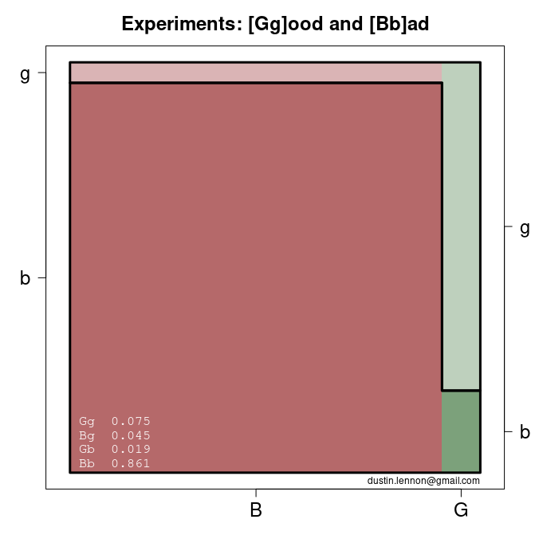
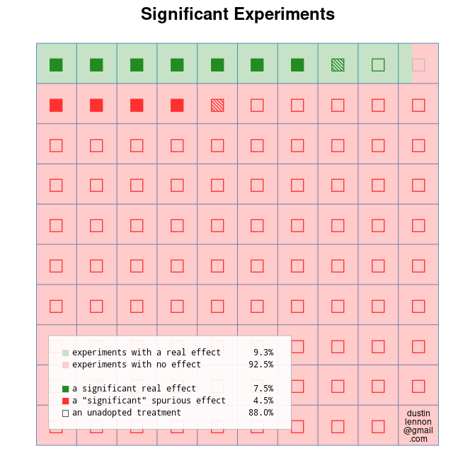

These scripts generate prettified figures based on a post shared by Ron Kohavi.  This first appeared on my LinkedIn feed in June 2024.

[original post](https://www.linkedin.com/posts/ronnyk_here-is-a-graphical-depiction-of-why-about-activity-7201985340968951808-DAUT?utm_source=share&utm_medium=member_desktop)

### fpr.R

An alternative visualization that "pivots" the data.

> It seems like a contribution in the post / linked doc is to estimate the win-rate, i.e. P(SS), and then use that to recover an estimate of 1 - P(H0), the 9.3% "true effect [estimate]" above. A plug-in estimate of FPR, as a function of alpha and power, follows readily.  
An alternative visualization might represents this 9.3% as the green column, associated with a sub-population of intrinsically Good experiments. This sub-population of the universe of all experiments abides by the assumption that when we attempt to label one of these experiments as good or bad, we'll get it right, say, 80% (the power) of the time.  
The other sub-population is the intrinsically Bad experiments. Here, when we attempt to label an experiment, we'll get it wrong, say, 5% (alpha) of the time.  
This is why there are four regions in the figure: Intrinsically Good, labeled bad; Intrinsically Bad, labeled good; etc. Each of these outcome pairs--Gg, Bg, Gb, Bb--has a probability, and these probabilities add to one.  
FPR focuses on the experiments that we labeled as good (the top, lighter shaded polygon). Of these, the light red ones were wrongly classified. So,  
  
fpr = Bg / (Bg + Gg)

### fpr2.R

A variant of Kohavi's original figure that attempts to better distinguish between two types of significant experiments:  real and spurious.  It uses color more directly and also visually marks unadopted treatments.

